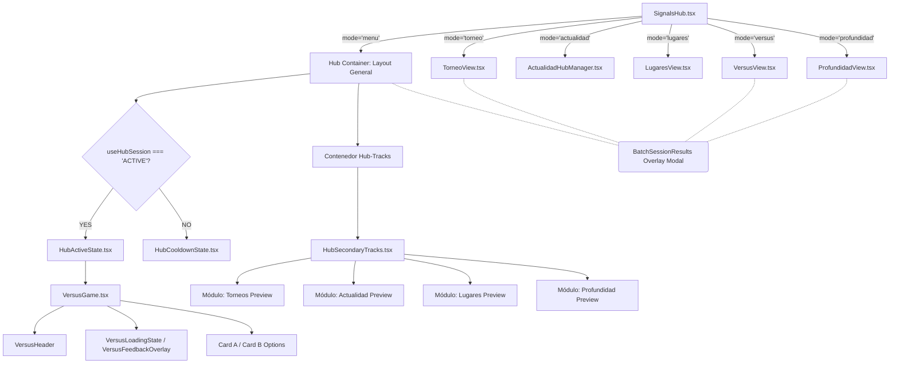

# Árbol de Renderizado de Señales (Render Tree)

Mapeo de la estructura nativa jerárquica cuando se dibuja la página y sus nodos más importantes en el flujo estándar.

### Explicación Estructural
El rediseño estructural asume que:
1. Las cabeceras como `PageHeader` inyectadas dinámicamente a nivel superior de "Señales" controlan lo que ve el usuario. 
2. Si un usuario se encuentra en `mode='menu'`, el árbol cargará secuencialmente `HubActiveState` en la parte superior del flujo y luego en `Hub-Tracks` desplegará el _Radar de Experiencias_. Ambas secciones comparten la misma pantalla vertical (`min-h-[100vh]`).
3. Modificar el árbol CSS a "Flex row" cambiará cómo el HubActiveState convive con HubSecondaryTracks, pero no destruirá la reactividad subyacente de cada módulo por separado.
